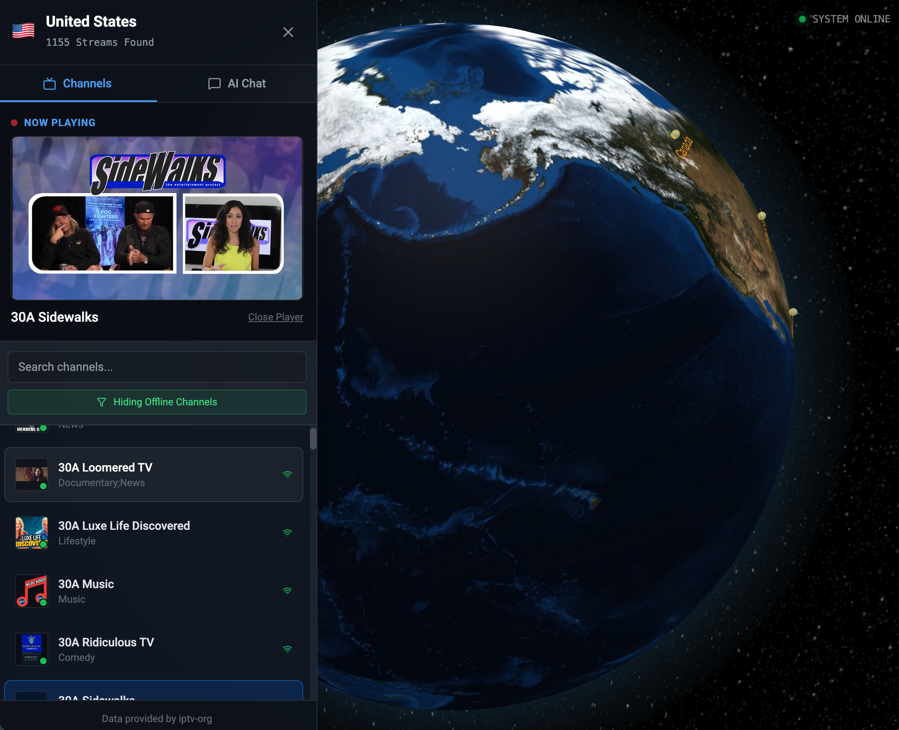

<div align="center">

# GlobalStream IPTV & VEO Studio

[](https://docs.docker.com/compose/)
[](https://github.com/jleboube/GlobalIPTV/stargazers)
[](https://github.com/jleboube/GlobalIPTV/network/members)
[](https://github.com/jleboube/GlobalIPTV/issues)
[](https://github.com/jleboube/GlobalIPTV/pulls)
[](https://creativecommons.org/licenses/by-nc-sa/4.0/)

[](https://www.buymeacoffee.com/muscl3n3rd)

[Demo](https://tv.z-p.me) • [Screenshots](#screenshots) • [Quick Start](#quick-start) • [Tech Stack](#tech-stack) 

</div>

## Screenshots

<div align="center">

GlobalTV Landing Page


GlobalTV Channels and Video Stream



</div>

This contains everything you need to run your app locally or deploy with Docker.


## Quick Start with Docker (Recommended)

**Prerequisites:** Docker and Docker Compose

1. **Set up environment variables:**
   ```bash
   cp .env.example .env.local
   ```
   Edit `.env.local` and add your Gemini API key

2. **Build and run with Docker Compose:**
   ```bash
   docker-compose up --build -d
   ```

3. **Access the app:**
   Open [http://localhost:8547](http://localhost:8547)

4. **View logs:**
   ```bash
   docker-compose logs -f
   ```

5. **Stop the app:**
   ```bash
   docker-compose down
   ```

### Docker Commands

```bash
# Rebuild and restart
docker-compose up --build -d

# Stop containers
docker-compose down

# View running containers
docker-compose ps

# Check health status
docker-compose ps app

# Access container shell
docker-compose exec app sh

# Remove all containers and volumes
docker-compose down -v
```

## Run Locally (Development)

**Prerequisites:** Node.js 20+

1. **Install dependencies:**
   ```bash
   npm install
   ```

2. **Set up environment:**
   ```bash
   cp .env.example .env.local
   ```
   Edit `.env.local` and add your Gemini API key

3. **Run development server:**
   ```bash
   npm run dev
   ```

4. **Access the app:**
   Open [http://localhost:3000](http://localhost:3000)

## Configuration

### Port Configuration

The app runs on port **8547** when using Docker to avoid conflicts with common ports. You can change this in `docker-compose.yml`:

```yaml
ports:
  - "YOUR_PORT:80"  # Change YOUR_PORT to any available port
```

### Environment Variables

Create a `.env.local` file with:

```env
GEMINI_API_KEY=your_gemini_api_key_here
NODE_ENV=production
```

## Project Structure

```
globalstream-iptv/
├── components/         # React components
├── services/          # API services
├── App.tsx            # Main application
├── index.tsx          # Entry point
├── constants.ts       # App constants
├── types.ts           # TypeScript types
├── Dockerfile         # Multi-stage Docker build
├── docker-compose.yml # Docker orchestration
├── nginx.conf         # Nginx configuration
└── vite.config.ts     # Vite configuration
```

## Docker Architecture

- **Multi-stage build** for optimized image size
- **Nginx** serves the production build
- **Health checks** for container monitoring
- **Port 8547** to avoid common port conflicts
- **Production-ready** with security headers and gzip compression

## Health Check

Access the health check endpoint:
- Docker: [http://localhost:8547/health](http://localhost:8547/health)
- Local dev: [http://localhost:3000/health](http://localhost:3000/health)

## Building for Production

### With Docker
```bash
docker-compose up --build -d
```

### Without Docker
```bash
npm run build
npm run preview
```

## Tech Stack

- **React 19** - UI Framework
- **TypeScript** - Type safety
- **Vite** - Build tool
- **Three.js** - 3D graphics
- **Google Gemini AI** - AI integration
- **Nginx** - Production server
- **Docker** - Containerization

## Notes

- The app is configured to run on an uncommon port (8547) to avoid conflicts
- All environment variables are loaded from `.env.local`
- The Docker setup uses multi-stage builds for optimal image size
- Nginx serves the built static files with proper caching and compression
- Health checks are configured for container monitoring

## Troubleshooting

### Docker build fails
```bash
# Clean rebuild
docker-compose down -v
docker-compose build --no-cache
docker-compose up -d
```

### Port already in use
Edit `docker-compose.yml` and change `8547` to another port

### Environment variables not working
Ensure `.env.local` exists and contains valid values

## License


